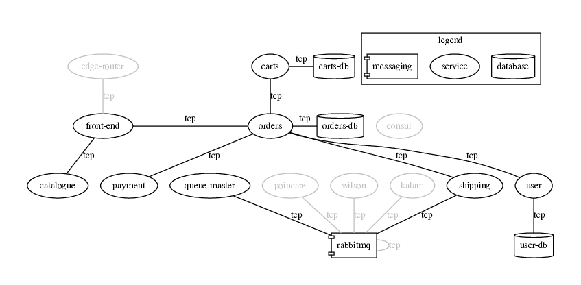
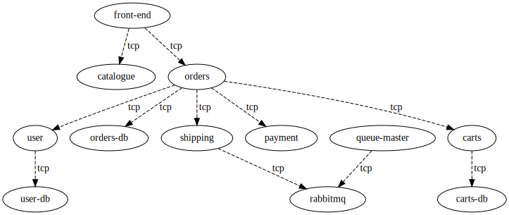
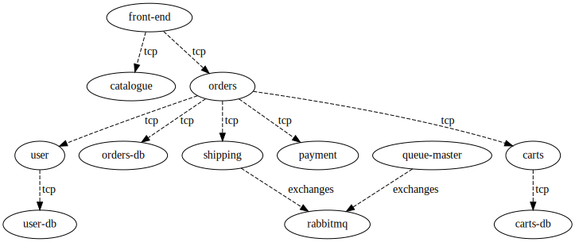
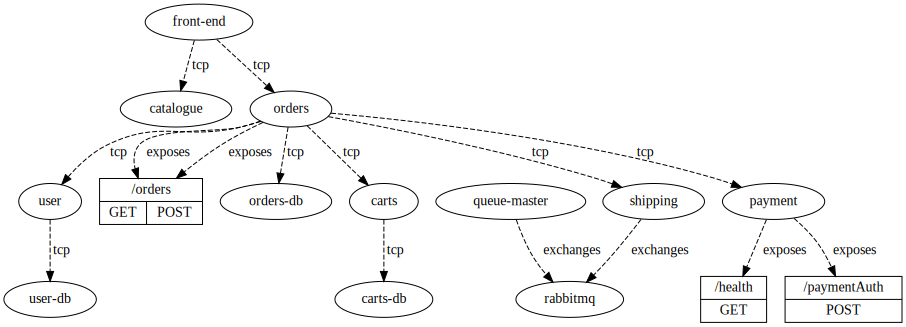
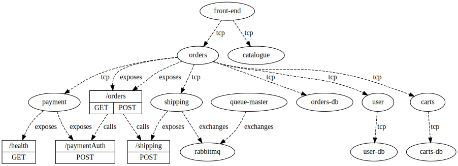

# Sockshop use case

[Sockshop](https://github.com/microservices-demo) is a generic microservices built web applicatication by [Weavescope](https://github.com/weaveworks).

The application is an ecommerce webapp built around 8 services in 3 languages, using 4 different databases and 2 message
buses. 

## Mapping

To create the mapping of the sockshop app, we will be using 3 general purposes probes, and a last specific probe
for the project:

1. [Kubernetes](../../probes/Kubernetes)
2. [RabbitMQ](../../probes/RabbitMQ)
3. [Swagger](../../probes/Swagger)
4. [Spring](../../probes/Spring)

### Kubernetes

The initial map that we have recreated from the artifacts of the microservice was produced by Weavescope themselves and
is available on [their github repo](https://github.com/microservices-demo/microservices-demo/tree/c0a1e59036233dcdb93c4aff82a07788365d19de#visualizing-the-application).

The first step is to remove the noise from what seems to be previous deployments. To do this, we will build a graph
representing the kubernetes deployment manifests, and union it with the current initial map.

### RabbitMQ

The next step is to determine the type of relation between the RabbitMQ service and the two nodes `shipping` and
`queue-master`.

The RabbitMQ probe analyses a Java code base to identify the usage of Spring's
[`TopicExchange`](https://docs.spring.io/spring-amqp/api/org/springframework/amqp/core/TopicExchange.html) class. From
this class, we extract the literal string of the topic being used by the application to link the RabbitMQ node properly.
This allows the relationship to change from the generic `TCP` to an `Exchanges` type.

### Swagger

The Swagger probe reads a Swagger API definition file and adds the routes to the service.

### Spring

Lastly, we use a specialized Spring probe that performs a static analysis on the [`Orders`](https://github.com/microservices-demo/orders)
app. This analysis will find for Spring's `RequestMapping` annotations to identify routes, and will check for the
calls to external services.

This probe will add the calls from the `POST /orders` route to the payment service's `POST /paymentAuth` route.

